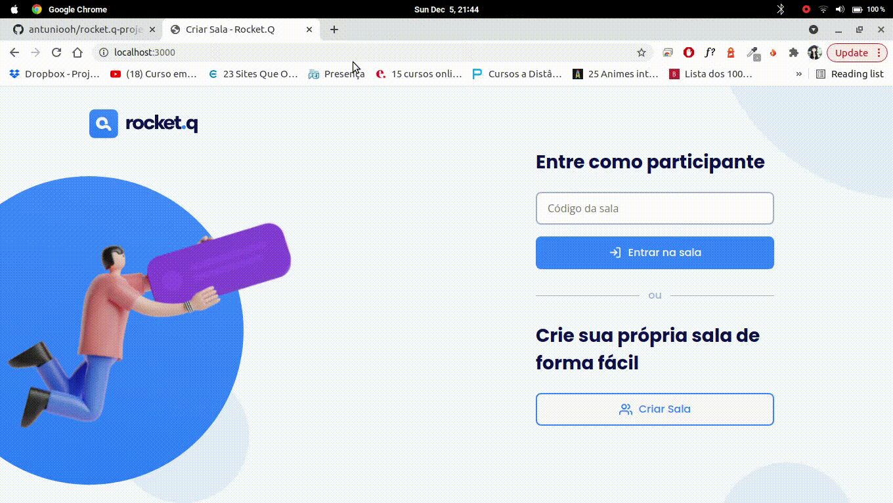

<p align="center">
  

  
  
  <a href="https://github.com/antuniooh/rocket.q-project/commits/master">
    
  </a>
  
   
</p>

<!-- PROJECT LOGO -->
<br />
<p align="center">
  <a href="https://github.com/antuniooh/rocket.q-project">
    
  </a>
</p>

<p align="center">
  
  
  
</p>


<!-- TABLE OF CONTENTS -->
<details open="open">
  <summary>Table of Contents</summary>
  <ol>
    <li>
      <a href="#-about-the-project">About The Project</a>
    </li>
    <li>
      <a href="#-how-to-run">How To Run</a>
    </li>
  </ol>
</details>


<!-- ABOUT THE PROJECT -->
## 💻 About The Project
Development of Rocket.q website, project given at NLW Together by Rocketseat. It consists of a website where the user can anonymously create rooms for questions




<!-- HOW TO RUN -->
## 🚀 How To Run

⚠️ For a better experience, open the project in the following link: https://antuniooh.github.io/rocket.q-project/ ⚠️

### Terminal
```bash

# Clone the repository
$ git clone https://github.com/antuniooh/rocket.q-project.git

# Access the project folder in your terminal / cmd
$ cd rocket.q-project

# Install libs
$ npm install

# Create database
$ npm run init-db

# Deploy 
$ npm start

```
The project will be hosted at "localhost:3000"
